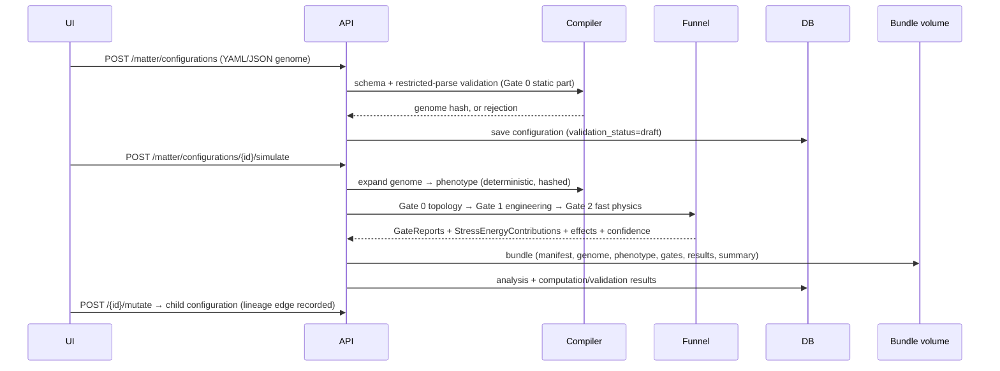

# Matter Forge — subsystem design (v0.2)

The first major enhancement to Metric Forge: a physically parameterized
configuration subsystem answering the engineering question *"given a
constrained set of physically describable materials, structures, fields,
motions, and boundary conditions, what configuration produces the most
useful spacetime or vacuum-energy effect?"* — with the same trust,
provenance, fail-loud, and bundle contracts as Geometry Forge.

This document is the §34 "first implementation task" response: architecture,
genome/phenotype design, composition approach, Casimir scope, search
interfaces, mutation representation, fidelity levels, confidence model,
unresolved questions, and risks. Implementation in v0.2.0 covers the
parallel-plate Casimir vertical path and the rotating classical-matter
validation case; everything else here is a designed, scheduled interface.

## 1. Architectural position

Matter Forge is a set of packages and workers *inside* Metric Forge — it
extends, and never bypasses, the existing experiment orchestration, worker
queue, result storage, provenance, validation framework, and export format.

```
packages/forge_matter/
  entities.py    MatterConfiguration, PhysicalComponent, QuantumBoundarySystem,
                 StressEnergyContribution, MutationRecord, ConfidenceLevel (C0–C6),
                 GateReport, MatterAnalysis
  materials.py   versioned, sourced material database (curated YAML)
  compiler.py    genome → phenotype expansion (deterministic, hashed)
  casimir.py     quantum-vacuum module (ideal parallel plates in v0.2.0)
  classical.py   Gate-2 classical models (Newtonian, gravitomagnetic)
  funnel.py      staged solver funnel (Gates 0–2 live; 3–5 explicit stubs)
  mutations.py   versioned mutation operator registry
  analysis.py    analysis runner → bundles (same manifest/checksum contract)
apps/api/matter.py   /api/v1/matter router
```

Reuse map: restricted expression parsing → `forge_metrics.parser`;
provenance/checksums/bundles → `apps.coordinator.provenance` + the bundle
layout; persistence → new tables beside the existing ones (same
`ComputationResult`/`ValidationResult` records, keyed by analysis id);
UI → new "Matter" view in the existing SPA.

### Sequence: analyze one configuration



Gates 0–2 are sub-second analytic evaluations and run inline in the API
process; Gate 3+ (numerical field solves) will route through the existing
Celery queues with a new worker capability declaration — scheduled, not
implemented (see §9 gating).

## 2. Genome vs phenotype

**Genome** = the configuration document itself (schema-validated YAML/JSON):
component topology, dimensions, positions, materials, density-profile
parameters, motion, EM parameters, quantum-boundary parameters, constraints.
It is the unit of mutation, crossover, hashing, and versioning. Genome hash
= sha256 of canonical JSON of the physics-relevant fields.

**Phenotype** = the deterministic expansion produced by the compiler:
per-component volume, mass, moment of inertia, angular momentum, rim speed,
stress estimates; gap regions for plate arrays; observation regions; the
totals the funnel consumes. Phenotype hash = sha256(canonical phenotype
JSON + compiler version). Contract: same genome + same compiler version ⇒
byte-identical phenotype (enforced by test). The phenotype carries every
approximation note the compiler made (e.g. "thin-shell moment of inertia",
"graded density integrated numerically, 512 samples").

v0.2.0 shape library: `sphere`, `spherical_shell`, `torus`, `box`,
`cylinder`, `parallel_plate_array`. Density models: `homogeneous`, `graded`
(restricted expression in `r_normalized`, evaluated numerically). Motion:
`none`, `rotation` (axis + angular velocity; rigid, validity-checked).
CSG, segmented/layered structures, velocity fields: schema reserved,
compiler rejects with explicit `unsupported`. Full file-format reference:
[matter-configuration-spec.md](matter-configuration-spec.md).

## 3. Stress-energy composition approach

`T_total = Σ contributions`, each a `StressEnergyContribution` carrying:
source component id, type (`matter|motion|mechanical|em|vacuum`), tensor
representation (analytic form + numeric values on its spatial support),
coordinate frame, SI units (with geometrized conversion factor recorded),
approximation level, confidence, and warnings. The composition engine keeps
component-level tensors forever — "which component created this feature?"
must always be answerable. Double-counting rule: a source registers energy
in exactly one contribution type (e.g. rotational kinetic energy lives in
the `motion` contribution, never also in `matter`); the composer verifies
each component's registered types are disjoint. v0.2.0 composes on
analytic supports (gap slabs, component bounding regions); common-grid
resampling arrives with Gate 3.

**Unit convention (energy accounting, per the v0.2 gating requirement):**
Matter Forge computes in SI. Every energy is reported in a five-part
account: local renormalized vacuum energy density (J/m³, relative to the
declared vacuum reference), integrated vacuum energy (J), apparatus rest
energy Σmc² (J), support/stored energy (fields, rotation; J), and total
system energy (J). No result may surface a negative local quantity without
its positive total-system context — enforced in the result model itself,
not just the UI.

## 4. Casimir solver scope (v0.2.0)

Implemented: **ideal parallel conducting plates at T = 0** (Brown–Maclay).
For separation *a*, area *A*, N plates ⇒ N−1 gaps:

* energy per unit area E/A = −π²ħc/(720 a³); total E = (N−1)·A·(E/A)
* force per unit area F/A = −π²ħc/(240 a⁴) (attractive; per gap; interior
  plates of an equal-spacing array see cancelling net force — reported)
* gap energy density u = −π²ħc/(720 a⁴)
* vacuum stress-energy in the gap: ⟨T^μ_ν⟩ = (π²ħc/720a⁴)·diag(−1, 1, 1, −3)
  (z normal to plates), with spatial support = gap slabs
* consistency identity F = −dE/da (validated numerically in the test suite)

Validity model (encoded, not prose): separation < 10 nm ⇒ `speculative`
(roughness/plasma-wavelength dominated, ideal model invalid); 10 nm–1 µm ⇒
`idealized` with warning that finite conductivity corrections of order
5–15 % are expected and unsupported; > 1 µm or T > 0.5 K ⇒ warning that
thermal corrections are unsupported (T recorded, computed at T = 0).
Result confidence: the *model* is literature-benchmarked (C5 checks in the
validation suite: 13.0 Pa at 100 nm, −0.433 µJ/m² at 100 nm, a⁻⁴ scaling);
a *configuration's* result is classified C2 (supported approximate model)
because real boundaries are not ideal conductors — with
`model_benchmarked: true` recorded alongside.

Extension interfaces (registered, all returning `model_unavailable`):
finite conductivity, finite temperature, layered/dielectric boundaries,
roughness, rectangular/cylindrical/spherical cavities, corrugated surfaces,
repulsive configurations, cavity arrays, time-dependent boundaries /
dynamical Casimir. Quantum-inequality hooks exist as metadata-only
interfaces (`quantum_inequality_status: not_evaluated`).

**Negative-energy semantics** are a hard contract: every Casimir result
embeds the five-part energy account (§3) and the fixed warning: *"A locally
negative renormalized vacuum-energy density does not imply that the
complete apparatus has negative total mass-energy."*

## 5. Classical matter path (v0.2.0 validation case)

Gate-2 models, all SI, all confidence C2 unless noted:

* Newtonian gravity at observation regions from analytic per-shape fields
  (sphere interior/exterior, shell interior/exterior — shell theorem; ring/
  torus on-axis; distant-point monopole fallback with explicit warning).
* Gravitomagnetic frame dragging: per-component angular momentum J = Iω
  (analytic I per shape), net J vector; exterior Lense–Thirring precession
  Ω = G[3(Ĵ·r̂)r̂ − J]/(c²r³); interior of a thin rotating shell
  Ω = 4GMω/(3c²R). Validation targets: linearity in ω, r⁻³ falloff,
  counter-rotation cancellation, mass conservation under density regrading.
* Engineering sanity (Gate 1): total mass vs constraint; rim speed vs
  `maximum_component_speed_fraction_c` (hard reject at ≥ c regardless of
  constraint); thin-ring hoop stress ρω²R² vs material tensile strength /
  safety factor; rigid-body validity warning when rim speed > 0.01c.

## 6. Solver funnel and fidelity levels

| gate | name | v0.2.0 status | confidence ceiling |
|---|---|---|---|
| 0 | schema + topology validation | **implemented** (JSON Schema, restricted parser, shape/material/motion resolution, plate-geometry sanity) | — |
| 1 | engineering sanity | **implemented** (mass, speed, hoop stress, stored/rest energy, constraint checks) | — |
| 2 | fast physical approximations | **implemented** (Newtonian, gravitomagnetic, ideal Casimir) | C2 |
| 3 | numerical field evaluation | interface + explicit `not_implemented` report | C3 |
| 4 | stationary GR solve | interface + explicit `not_implemented` report; will reuse Geometry Forge's pipeline on weak-field metrics | C4 |
| 5 | dynamic evolution | interface + explicit `not_implemented` report | C4+ |

Every analysis records `highest_gate_completed` and per-gate reports
(passed / failed / flagged / not_implemented) in the bundle.

## 7. Confidence classification (implemented)

`ConfidenceLevel` enum, stored on every contribution and effect, displayed
beside every number in the UI: **C0** invalid · **C1** exploratory proxy ·
**C2** numerical/analytic approximation of a supported model · **C3**
converged numerical result · **C4** cross-validated across independent
solvers · **C5** literature benchmarked · **C6** experimentally reproduced.
Rule: the platform itself can never assign C6; C4 requires the independent
second solver (blocked on backlog B-2); C5 attaches to *models* through the
validation suite, not to arbitrary configurations.

## 8. Search interfaces (designed; execution gated)

* **Campaign schema** (`schemas/matter-campaign.schema.json`): objectives
  (metric, direction, observation region), allowed components, constraints,
  mutable parameters, strategy, population, budget, stopping conditions,
  seed. Campaigns can be created and validated; execution returns an
  explicit `not_available` status until the gating items land (§9).
* **Strategy interface**: `propose(campaign, lineage, rng) → [genome]` /
  `observe(results)` — grid, random, Bayesian, evolutionary,
  multi-objective (Pareto), novelty are registry names; none are wired to
  an executor in v0.2.0.
* **Mutation representation** (implemented): versioned operators
  (`operator@semver`) that take (genome, params, seed) and return a new
  genome plus a `MutationRecord` {operator, version, before, after, reason,
  seed, affected components}. Child configurations carry `parent_ids`,
  `generation`, and full mutation history; lineage is stored and exportable.
  v0.2.0 catalog: `alter_separation`, `alter_plate_area`,
  `alter_plate_count`, `alter_angular_velocity`, `reverse_rotation`,
  `change_density` — the full §14 catalog is scheduled with the campaign
  engine. Crossover operates on semantic units (component groups, boundary
  systems) — designed, not implemented.
* **Scoring**: full score vectors only (effect, cost, buildability, safety,
  confidence, novelty components), never a lone aggregate; Pareto fronts
  are the presentation primitive. Implemented in v0.2.0 as the score-vector
  data model populated by Gate 1–2 outputs (effect, mass, stored energy,
  safety margin, confidence); search-time Pareto ranking ships with the
  campaign engine.

## 9. Gating: what must land before autonomous search

Per the v0.2 mandate, campaign execution (`/campaigns/{id}/start`) stays
disabled until each of these is complete or explicitly waived per-campaign:

1. **Independent solver verification** (B-2) — C4 must be achievable for
   any candidate a campaign wants to promote.
2. **Geodesic + tidal diagnostics** (B-5) — required by effect scoring and
   safety scoring (destructive tidal gradients).
3. **Energy-accounting conventions** (B-18, this doc §3) — five-part
   account implemented in v0.2.0; the remaining work is proper-volume
   integration for curved backgrounds (U-4).
4. **Worker capability enforcement** (B-13) — coordinator must reject jobs
   exceeding declared limits before fan-out-scale workloads.
5. **Quarantine/promotion workflow** (B-7) — generated candidates never
   enter trusted storage without the six-step promotion path; the
   `validation_status` field and lineage `promotion_status` are already in
   the data model.

## 10. Unresolved scientific questions

* **US-1** Which vacuum reference for renormalized energy density in
  non-ideal boundaries — free space, or the medium's own ground state?
* **US-2** Superposing weak-field metric perturbations from multiple
  sources: linearized GR permits it, but at what source strength do we
  require a nonlinear (Gate 4) re-solve before reporting?
* **US-3** Rotating *graded* bodies: rigid rotation of a graded-density
  solid is not a self-consistent GR source at high ω — where is the honest
  cutoff for the rigid approximation (currently warned at 0.01c rim speed)?
* **US-4** Casimir stress-energy outside the gap (edge effects): ideal
  model has sharp support; real support is smeared — how to represent
  without inventing an unsupported profile? (v0.2.0: sharp support +
  warning.)
* **US-5** Frame-dragging observables: which instrument model (gyroscope
  precession vs ring-laser phase) is the least approximation-sensitive
  first target for §20 instruments?

## 11. Unresolved engineering questions

* **UE-1** Mesh/grid representation for Gate 3 (regular grids reuse
  `forge_math.numeric`; FEM would need a new dependency — decision
  deferred until an EM numerical backend is chosen).
* **UE-2** External EM solver integration boundary (import fields vs run
  solver in a worker container).
* **UE-3** Lineage storage at campaign scale (rows per candidate explode
  at population 500 × 1000 generations; likely needs a compacted
  genome-delta encoding).
* **UE-4** Whether Gate 2 inline execution should move to the queue for
  batch mutation sweeps (currently instant; irrelevant until campaigns).

## 12. Risks that could invalidate results

1. **Unit errors across the SI ↔ geometrized boundary** — mitigated by
   recording conversion factors in every contribution and testing known
   values in both unit systems.
2. **Double counting** rotational/field energy in multiple contributions —
   mitigated by the disjoint-registration rule (§3) and the
   component-sum-equals-total pipeline validation.
3. **Idealized Casimir extrapolated outside validity** — mitigated by the
   encoded validity model, `speculative` classification, and refusal to
   compute unsupported geometries.
4. **Rigid-rotation fiction at high rim speed** — warned at 0.01c,
   engineering-rejected at the campaign speed constraint, hard-rejected
   at c.
5. **Aggregate-score selection pressure** laundering away safety or
   confidence — mitigated by score vectors + Pareto-only presentation, and
   hard constraints evaluated outside the scoring path.
6. **Lineage bias**: seeds recorded everywhere; identical genome ⇒
   identical phenotype hash makes silent divergence detectable.
